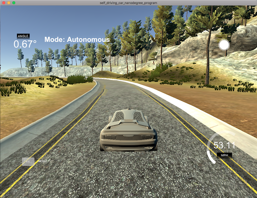

# PID Controller Project
## by Soeren Walls

### Video of Simulation

[Here is a link](PID_Controller_Demo.mov) to a video of my PID Controller successfully going around the track in the simulation.

### Understanding the PID algorithm

This was a fun project that allowed me to observe the effect that the P, I, and D components of the PID algorithm have on their implementation. It was a little fuzzy before, but after completing this project, it makes a lot of sense.

The **P component** has a direct effect on how reactive the car is to being off-center. The higher the P component, the more drastic the reaction, and the more wobbly the car gets. The **I component** is really only useful if there is a misalignment of the wheels that causes a consistent tendency to drift toward a specific direction, and therefore setting this component to anything other than 0 is not helpful for the purposes of this project. The **D component** affects how the car reacts as the error becomes greater or smaller; in other words - the higher the D component, the smoother the reaction, and therefore the steering becomes more stable. Like I said, I didn't understand this completely until I had a chance to see these parameters in action during this project.

It's important to find a good balance between the P and D components. I did this via manually tuning the parameters and testing them in the simulator. You don't want the P component too small, otherwise the car won't return to center quickly enough. You also don't want it too big, otherwise the car will overcorrect way too much and veer off the side of the road. Similarly, you don't want the D component too small, otherwise the P component has too much control over the car's reaction speed. You also don't want it too big, or else the P component doesn't have enough control over the car's reaction time.

The following values worked well for me: **P=-0.2, I=0.0, D=-3.0**.

### Using a PID controller for both steering and throttling

You'll notice that I not only implemented the steering algorithm, but I also used a PID controller to control the throttling (acceleration) of the car. This was essentially the same idea as steering, but instead of trying to get to a center point on the road (x=0), the PID controller for speed tried to maintain a constant throttle of 0.8. 

Using the same exact error metric as the steering control (CTE), I was able to get an average speed of around 50mph, using the following parameters: **P=-0.6, I=0.0, D=1.0**.

Again, this was done via manual tuning. As you can see in the simulation, it runs a lot like you might expect a human to drive - slowing down at sharp turns, and speeding up during straighter parts of the track. This was also a lot of fun to play around with.